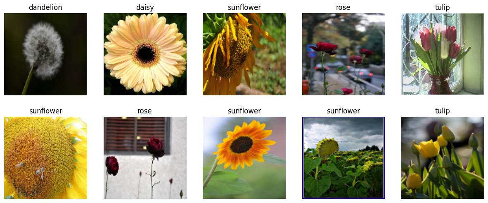
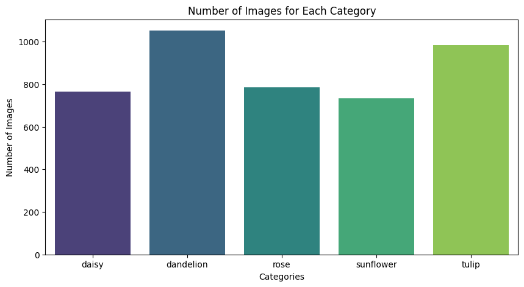

# Flower Classification with CNN

This project uses Convolutional Neural Networks (CNN) to classify images of flowers into different categories. The dataset consists of flower images categorized into five classes. The model is trained using TensorFlow and Keras.

## Table of Contents

- [Flower Classification with CNN](#flower-classification-with-cnn)
  - [Table of Contents](#table-of-contents)
  - [Project Description](#project-description)
  - [Dataset](#dataset)
    - [Example Images from the Dataset](#example-images-from-the-dataset)
    - [Number of images for each category](#number-of-images-for-each-category)
  - [Model Architecture](#model-architecture)
  - [Installation](#installation)
  - [Results](#results)
    - [Training and Validation Accuracy and Loss](#training-and-validation-accuracy-and-loss)
    - [Predictions on Test Set](#predictions-on-test-set)
    - [Test Set Performance](#test-set-performance)

## Project Description

This project involves building a CNN to classify flower images. The images are preprocessed, augmented, and then fed into the CNN model for training. The performance of the model is evaluated on a test set, and the results are visualized.

## Dataset

The dataset used in this project consists of flower images stored in a directory structure, where each subdirectory represents a category of flowers. The images are resized to 128x128 pixels before being fed into the model.

### Example Images from the Dataset



### Number of images for each category



## Model Architecture

The CNN model used in this project has the following architecture:

- Convolutional layers with ReLU activation
- Average Pooling layers
- Fully connected (Dense) layers with ReLU activation
- Dropout layers for regularization
- Output layer with softmax activation

The model is compiled with Adam optimizer and categorical cross-entropy loss.

## Installation

To run this project, you need to have Python and the required libraries installed. You can install the dependencies using the following command:

```bash
pip install -r requirements.txt
```

****

## Results

### Training and Validation Accuracy and Loss


### Predictions on Test Set

Below are some sample predictions on the test set. Green titles indicate correct predictions, while red titles indicate incorrect predictions.


### Test Set Performance

- **Test Loss:** `0.6624156832695007`
- **Test Accuracy:** `0.7650462985038757`

